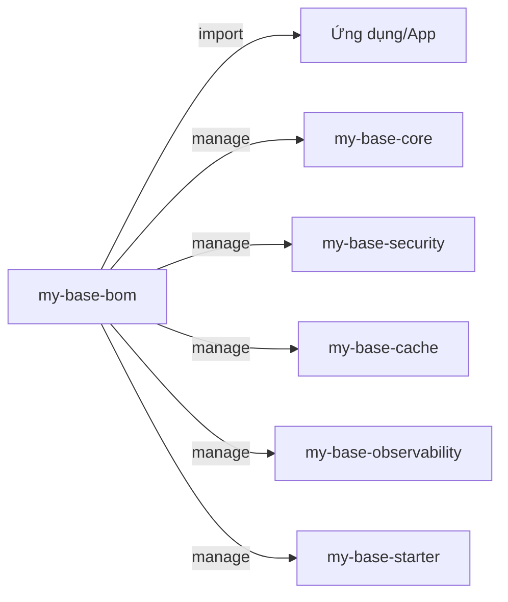

## 1. Mục tiêu (Objective)

- Cung cấp BOM `my-base-bom` để khoá version thư viện (theo Spring Boot và nội bộ) giúp modules/app không cần chỉ định `<version>` lặp lại, giảm drift.
- Tập trung hoá việc override/lock versions; đảm bảo tính tương thích và bảo mật qua quản trị phiên bản tập trung.

## 2. Kiến trúc/Thiết kế tổng quan (Overview)

- Kiểu: `pom` (`packaging=pom`), vai trò: `dependencyManagement`.
- Import `spring-boot-dependencies` (scope `import`) để đồng bộ hệ sinh thái Spring.
- Khai báo versions cho các artifact nội bộ `my-base-*` theo `${project.version}`.

Sơ đồ quan hệ sử dụng:



## 3. Các bước setup chi tiết (Step-by-step Setup)

1) Khởi tạo BOM POM

```xml
<project>
  <modelVersion>4.0.0</modelVersion>
  <parent>
    <groupId>com.mycompany.base</groupId>
    <artifactId>my-base-parent</artifactId>
    <version>1.0.0-SNAPSHOT</version>
  </parent>
  <artifactId>my-base-bom</artifactId>
  <packaging>pom</packaging>
  <dependencyManagement>
    <dependencies>
      <dependency>
        <groupId>org.springframework.boot</groupId>
        <artifactId>spring-boot-dependencies</artifactId>
        <version>${spring.boot.version}</version>
        <type>pom</type>
        <scope>import</scope>
      </dependency>
      <dependency>
        <groupId>com.mycompany.base</groupId>
        <artifactId>my-base-core</artifactId>
        <version>${project.version}</version>
      </dependency>
      <!-- add other internal modules: security, cache, observability, starter -->
    </dependencies>
  </dependencyManagement>
</project>
```

2) Cách dùng từ ứng dụng

```xml
<dependencyManagement>
  <dependencies>
    <dependency>
      <groupId>com.mycompany.base</groupId>
      <artifactId>my-base-bom</artifactId>
      <version>1.0.0-SNAPSHOT</version>
      <type>pom</type>
      <scope>import</scope>
    </dependency>
  </dependencies>
</dependencyManagement>

<dependencies>
  <dependency>
    <groupId>com.mycompany.base</groupId>
    <artifactId>my-base-starter</artifactId>
  </dependency>
</dependencies>
```

## 4. Cấu hình (Configuration)

- Tập trung override versions tại BOM (ví dụ: caffeine, jjwt, nimbus-jose-jwt, micrometer, logback...).
- Nguyên tắc: chỉ quản lý version, không thêm dependencies runtime bên ngoài `dependencyManagement`.
- Đồng bộ `${spring.boot.version}` với parent để tránh mismatch.

Ví dụ override thêm thư viện:

```xml
<dependencyManagement>
  <dependencies>
    <dependency>
      <groupId>com.github.ben-manes.caffeine</groupId>
      <artifactId>caffeine</artifactId>
      <version>3.1.8</version>
    </dependency>
  </dependencies>
</dependencyManagement>
```

## 5. Cách kiểm thử/triển khai (Testing & Deployment)

- Kiểm tra hiệu lực BOM: `mvn -pl my-base-bom -am -DskipTests help:effective-pom`.
- Tạo sample app import BOM, kiểm tra build thành công mà không chỉ định `<version>` cho libs đã quản lý.
- Triển khai: deploy theo cơ chế chung của parent (snapshots/releases) lên Nexus/Artifactory.

## 6. Lưu ý mở rộng/Best practices

- Duy trì changelog khi thay đổi version; dùng Renovate/Dependabot để cập nhật an toàn.
- Tránh override quá nhiều gây lệch `spring-boot-dependencies`; cân nhắc rủi ro tương thích.
- Sử dụng SCA (OWASP Dependency-Check, Snyk, Trivy) trong pipeline trước khi release.

## 7. Tài liệu tham khảo (References)

- Spring Boot BOM (`spring-boot-dependencies`).
- Maven BOM best practices, Effective POM.

