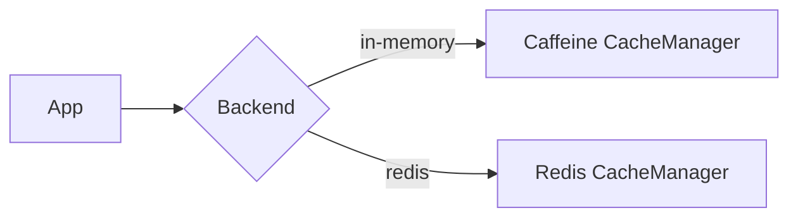

## 1. Mục tiêu (Objective)

- Chuẩn hoá lớp cache abstraction dùng chung với backend linh hoạt (Caffeine in-memory, Redis) và chính sách TTL/keys thống nhất.
- Tách code thuần (contracts, utilities) khỏi auto-config để tránh xung đột cấu hình.

## 2. Kiến trúc/Thiết kế tổng quan (Overview)

- Kiểu: `jar` (library). Phụ thuộc: `spring-boot-starter-cache`, optional `spring-data-redis`, optional `caffeine`.
- Cung cấp: `CacheKeyStrategy`, `CacheNames`, `CacheProperties`, serializers và helper.

Sơ đồ lựa chọn backend:



## 3. Các bước setup chi tiết (Step-by-step Setup)

1) POM và dependencies:

```xml
<dependencies>
  <dependency>
    <groupId>org.springframework.boot</groupId>
    <artifactId>spring-boot-starter-cache</artifactId>
  </dependency>
  <!-- optional backends -->
  <dependency>
    <groupId>org.springframework.data</groupId>
    <artifactId>spring-data-redis</artifactId>
    <optional>true</optional>
  </dependency>
  <dependency>
    <groupId>com.github.ben-manes.caffeine</groupId>
    <artifactId>caffeine</artifactId>
    <optional>true</optional>
  </dependency>
</dependencies>
```

2) Thành phần code

- `CacheProperties`: default TTL, map TTL per cache, key prefix, serialization options.
- `CacheKeyStrategy`: chuẩn hoá key: `${app}:${cache}:${version}:${businessKey}`.
- Serializers: JSON (Jackson) cho Redis, `StringRedisSerializer` cho keys.

3) Auto-config (ở starter)

```java
@Bean
@ConditionalOnClass(io.lettuce.core.RedisClient.class)
@ConditionalOnProperty(prefix = "base.cache", name = "type", havingValue = "redis")
CacheManager redisCacheManager(RedisConnectionFactory cf, CacheProperties props) {
  // build RedisCacheManager with serialization and TTL map
}
```

## 4. Cấu hình (Configuration)

Ví dụ cấu hình application.yaml:

```yaml
base:
  cache:
    type: caffeine # hoặc redis
    prefix: myapp
    default-ttl-seconds: 3600
    specs:
      userById:
        ttl-seconds: 600
      templateByKey:
        ttl-seconds: 3600
```

## 5. Cách kiểm thử/triển khai (Testing & Deployment)

- Unit: test key strategy, TTL mapping.
- Integration: với Redis docker (Testcontainers) và Caffeine.
- Deploy: publish library; app chọn backend qua properties.

Docker Redis (dev):

```bash
docker run -p 6379:6379 --name redis -d redis:7-alpine
```

## 6. Lưu ý mở rộng/Best practices

- Scalability: Redis cluster/sentinel; phân vùng key theo prefix.
- Security: không cache dữ liệu nhạy cảm hoặc dùng encrypt-at-rest/in-transit.
- Performance: tune Caffeine (maximumSize, expireAfterWrite); dùng JSON compact cho Redis.

## 7. Tài liệu tham khảo (References)

- Spring Cache Abstraction, Redis Cache, Caffeine docs.

