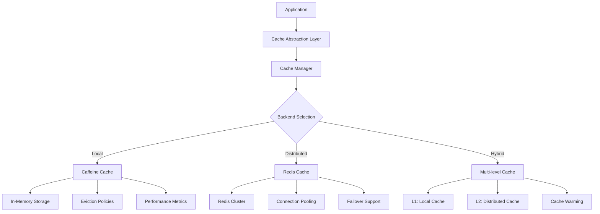

## 1. Mục tiêu (Objective)

- Chuẩn hoá lớp cache abstraction enterprise-grade với backend linh hoạt (Caffeine in-memory, Redis) và chính sách TTL/keys thống nhất.
- Implement advanced caching strategies: cache warming, eviction policies, distributed caching, và performance optimization.
- Tách code thuần (contracts, utilities) khỏi auto-config để tránh xung đột cấu hình.
- Đảm bảo high availability, data consistency, và optimal performance cho production workloads.

## 2. Kiến trúc/Thiết kế tổng quan (Overview)

- Kiểu: `jar` (pure library). Library KHÔNG khai báo Spring bean; auto-config sẽ nằm ở `java-base-starter`.
- Phụ thuộc trong library: optional `caffeine`, optional serializers; tránh kéo `spring-boot-starter-cache`/`spring-data-redis` trực tiếp (để starter quản lý).
- Cung cấp: `CacheKeyStrategy`, `CacheNames`, contracts, serializers và helper. Starter sẽ wire `CacheManager`/backends.

### Cache Components
- **Cache Abstraction**: Unified interface cho multiple backends
- **Key Management**: Namespace, versioning, và collision prevention
- **Serialization**: JSON, binary, và custom serializers
- **Eviction Policies**: LRU, LFU, TTL-based, size-based
- **Cache Warming**: Preload critical data, background refresh
- **Monitoring**: Cache hit/miss ratios, performance metrics
- **Distributed Caching**: Redis cluster, sentinel support

Sơ đồ kiến trúc cache:



## 3. Các bước setup chi tiết (Step-by-step Setup)

1) POM và dependencies (library tối giản):

```xml
<dependencies>
  <!-- optional backends kept optional in library -->
  <dependency>
    <groupId>com.github.ben-manes.caffeine</groupId>
    <artifactId>caffeine</artifactId>
    <optional>true</optional>
  </dependency>
  <dependency>
    <groupId>com.fasterxml.jackson.core</groupId>
    <artifactId>jackson-databind</artifactId>
    <optional>true</optional>
  </dependency>
</dependencies>
```

2) Advanced Cache Key Strategy (no Spring annotations)

```java
public class CacheKeyStrategy {
    
    private final String appName;
    private final String version;
    
    public String generateKey(String cacheName, Object... params) {
        StringBuilder keyBuilder = new StringBuilder();
        keyBuilder.append(appName).append(":");
        keyBuilder.append(cacheName).append(":");
        keyBuilder.append(version).append(":");
        
        for (Object param : params) {
            keyBuilder.append(param.toString()).append(":");
        }
        
        return keyBuilder.toString().replaceAll(":$", "");
    }
    
    public String generatePattern(String cacheName) {
        return appName + ":" + cacheName + ":" + version + ":*";
    }
}
```

3) Cache Warming Implementation (đặt ở starter)

```java
// Được triển khai trong starter: lắng nghe ApplicationReadyEvent/Scheduling và sử dụng CacheManager
```

4) Multi-level Cache Implementation (no Spring annotations)

```java
public class MultiLevelCacheManager implements CacheManager {
    
    private final CacheManager localCacheManager;
    private final CacheManager distributedCacheManager;
    
    @Override
    public Cache getCache(String name) {
        return new MultiLevelCache(
            localCacheManager.getCache(name),
            distributedCacheManager.getCache(name)
        );
    }
}

public class MultiLevelCache implements Cache {
    
    private final Cache l1Cache; // Local
    private final Cache l2Cache; // Distributed
    
    @Override
    public ValueWrapper get(Object key) {
        // Try L1 first
        ValueWrapper value = l1Cache.get(key);
        if (value != null) {
            return value;
        }
        
        // Try L2
        value = l2Cache.get(key);
        if (value != null) {
            // Populate L1
            l1Cache.put(key, value.get());
        }
        
        return value;
    }
}
```

5) Performance Monitoring (ở starter)

```java
public class CacheMetricsCollector {
    
    private final MeterRegistry meterRegistry;
    private final Map<String, CacheStats> cacheStats = new ConcurrentHashMap<>();
    
    // Đăng ký listeners ở starter, đẩy metrics qua Micrometer
    public void onCacheHit(CacheHitEvent event) {
        String cacheName = event.getCacheName();
        cacheStats.computeIfAbsent(cacheName, k -> new CacheStats())
            .incrementHits();
        
        meterRegistry.counter("cache.hits", "cache", cacheName).increment();
    }
    
    public void onCacheMiss(CacheMissEvent event) {
        String cacheName = event.getCacheName();
        cacheStats.computeIfAbsent(cacheName, k -> new CacheStats())
            .incrementMisses();
        
        meterRegistry.counter("cache.misses", "cache", cacheName).increment();
    }
    
    public void reportMetrics() {
        cacheStats.forEach((cacheName, stats) -> {
            double hitRatio = stats.getHitRatio();
            meterRegistry.gauge("cache.hit.ratio", Tags.of("cache", cacheName), hitRatio);
        });
    }
}
```

6) Auto-config (ở starter)

```java
@Bean
@ConditionalOnClass(io.lettuce.core.RedisClient.class)
@ConditionalOnProperty(prefix = "base.cache", name = "type", havingValue = "redis")
CacheManager redisCacheManager(RedisConnectionFactory cf, CacheProperties props) {
  RedisCacheManager.Builder builder = RedisCacheManager.builder(cf)
      .cacheDefaults(RedisCacheConfiguration.defaultCacheConfig()
          .serializeKeysWith(RedisSerializationContext.SerializationPair
              .fromSerializer(new StringRedisSerializer()))
          .serializeValuesWith(RedisSerializationContext.SerializationPair
              .fromSerializer(new GenericJackson2JsonRedisSerializer()))
          .entryTtl(Duration.ofSeconds(props.getDefaultTtlSeconds())));
  
  // Configure per-cache TTL
  props.getSpecs().forEach((cacheName, spec) -> {
      builder.withCacheConfiguration(cacheName, 
          RedisCacheConfiguration.defaultCacheConfig()
              .entryTtl(Duration.ofSeconds(spec.getTtlSeconds())));
  });
  
  return builder.build();
}

@Bean
@ConditionalOnClass(com.github.benmanes.caffeine.cache.Cache.class)
@ConditionalOnProperty(prefix = "base.cache", name = "type", havingValue = "caffeine")
CacheManager caffeineCacheManager(CacheProperties props) {
  CaffeineCacheManager manager = new CaffeineCacheManager();
  manager.setCacheNames(props.getSpecs().keySet());
  props.getSpecs().forEach((name, spec) -> {
    Caffeine<Object, Object> builder = Caffeine.newBuilder()
        .maximumSize(spec.getMaxSize())
        .expireAfterWrite(Duration.ofSeconds(spec.getTtlSeconds()))
        .recordStats();
    manager.registerCustomCache(name, new CaffeineCache(name, builder.build()));
  });
  return manager;
}

// Lưu ý: để đồng bộ L1 invalidation khi L2 (Redis) thay đổi, dùng Redis pub/sub để broadcast thông điệp invalidate tới các nút → xoá key tương ứng trong L1.
```

## 4. Cấu hình (Configuration)

### 4.1 Basic Cache Configuration
```yaml
base:
  cache:
    type: caffeine # hoặc redis, hybrid
    prefix: myapp
    version: v1
    default-ttl-seconds: 3600
    specs:
      userById:
        ttl-seconds: 600
        max-size: 10000
        eviction-policy: LRU
      templateByKey:
        ttl-seconds: 3600
        max-size: 1000
        eviction-policy: LFU
      configuration:
        ttl-seconds: 7200
        max-size: 500
        eviction-policy: LRU
```

### 4.2 Redis Configuration
```yaml
base:
  cache:
    redis:
      cluster:
        enabled: false
        nodes: ["redis1:6379", "redis2:6379", "redis3:6379"]
      sentinel:
        enabled: false
        master: mymaster
        nodes: ["sentinel1:26379", "sentinel2:26379"]
      connection-pool:
        max-active: 20
        max-idle: 10
        min-idle: 5
        max-wait: 3000ms
      timeout:
        connect: 5000ms
        command: 3000ms
      serialization:
        key-serializer: string
        value-serializer: json
```

### 4.3 Cache Warming Configuration
```yaml
base:
  cache:
    warming:
      enabled: true
      startup-delay: 30s
      refresh-interval: 5m
      caches:
        - name: userById
          warm-on-startup: true
          refresh-interval: 10m
        - name: configuration
          warm-on-startup: true
          refresh-interval: 1h
```

### 4.4 Performance Monitoring
```yaml
base:
  cache:
    monitoring:
      enabled: true
      metrics-interval: 1m
      alert-thresholds:
        hit-ratio: 0.8
        miss-rate: 100
        eviction-rate: 50
      health-check:
        enabled: true
        interval: 30s
        timeout: 5s
```

## 5. Cách kiểm thử/triển khai (Testing & Deployment)

### 5.1 Unit Testing
```java
@ExtendWith(MockitoExtension.class)
class CacheServiceTest {
    
    @Test
    void shouldGenerateCorrectCacheKey() {
        CacheKeyStrategy strategy = new CacheKeyStrategy("myapp", "v1");
        String key = strategy.generateKey("users", "123", "profile");
        assertThat(key).isEqualTo("myapp:users:v1:123:profile");
    }
    
    @Test
    void shouldHandleCacheEviction() {
        // Test eviction policies
        Cache cache = cacheManager.getCache("test");
        // Fill cache beyond max size
        // Verify eviction behavior
    }
}
```

### 5.2 Integration Testing
```java
@SpringBootTest
@Testcontainers
class CacheIntegrationTest {
    
    @Container
    static GenericContainer<?> redis = new GenericContainer<>("redis:7-alpine")
            .withExposedPorts(6379);
    
    @Test
    void shouldWorkWithRedis() {
        // Test Redis cache operations
        Cache cache = cacheManager.getCache("test");
        cache.put("key", "value");
        assertThat(cache.get("key").get()).isEqualTo("value");
    }
    
    @Test
    void shouldWorkWithCaffeine() {
        // Test Caffeine cache operations
        // Switch to caffeine backend
    }
}
```

### 5.3 Performance Testing
```java
@Test
void shouldHandleHighLoad() {
    // Load testing
    int threadCount = 100;
    int operationsPerThread = 1000;
    
    ExecutorService executor = Executors.newFixedThreadPool(threadCount);
    CountDownLatch latch = new CountDownLatch(threadCount);
    
    for (int i = 0; i < threadCount; i++) {
        executor.submit(() -> {
            try {
                for (int j = 0; j < operationsPerThread; j++) {
                    cache.put("key" + j, "value" + j);
                    cache.get("key" + j);
                }
            } finally {
                latch.countDown();
            }
        });
    }
    
    assertThat(latch.await(30, TimeUnit.SECONDS)).isTrue();
}
```

### 5.4 Deployment
- Unit: test key strategy, TTL mapping, eviction policies.
- Integration: với Redis docker (Testcontainers) và Caffeine.
- Performance: load testing với high concurrency.
- Deploy: publish library; app chọn backend qua properties.

Docker Redis (dev):

```bash
# Single instance
docker run -p 6379:6379 --name redis -d redis:7-alpine

# Redis cluster
docker-compose -f redis-cluster.yml up -d

# Redis with sentinel
docker-compose -f redis-sentinel.yml up -d
```

## 6. Lưu ý mở rộng/Best practices

### 6.1 Performance Optimization
- **Cache Warming**: Preload critical data on startup, background refresh cho hot data.
- **Multi-level Caching**: Combine local (L1) và distributed (L2) cache cho optimal performance.
- **Connection Pooling**: Tune Redis connection pool cho high concurrency.
- **Serialization**: Use efficient serializers (JSON compact, binary cho large objects).
- **Eviction Policies**: Choose appropriate policies (LRU, LFU, TTL-based) based on access patterns.

### 6.2 Scalability Considerations
- **Redis Cluster**: Use cluster mode cho horizontal scaling.
- **Key Partitioning**: Phân vùng key theo prefix để distribute load.
- **Cache Sharding**: Implement consistent hashing cho distributed caching.
- **Memory Management**: Monitor memory usage, implement proper eviction strategies.

### 6.3 Security Best Practices
- **Data Classification**: Không cache dữ liệu nhạy cảm (PII, passwords, tokens).
- **Encryption**: Use encrypt-at-rest/in-transit cho sensitive cached data.
- **Access Control**: Implement proper authentication/authorization cho cache access.
- **Audit Logging**: Log cache access patterns cho security monitoring.

### 6.4 Monitoring & Observability
- **Metrics Collection**: Track hit/miss ratios, eviction rates, response times.
- **Health Checks**: Monitor cache health, connection status, memory usage.
- **Alerting**: Set up alerts cho cache failures, performance degradation.
- **Distributed Tracing**: Trace cache operations trong distributed systems.

### 6.5 Reliability & Fault Tolerance
- **Failover Support**: Implement graceful degradation khi cache unavailable.
- **Circuit Breaker**: Use circuit breaker pattern cho cache operations.
- **Retry Logic**: Implement retry với exponential backoff.
- **Data Consistency**: Handle cache invalidation và consistency properly.

## 7. Tài liệu tham khảo (References)

- **Spring Cache Abstraction**: Cache abstraction layer, annotations, configuration
- **Redis Documentation**: Redis cluster, sentinel, performance tuning
- **Caffeine Documentation**: High-performance Java caching library
- **Lettuce Documentation**: Advanced Redis Java client
- **Micrometer Metrics**: Cache metrics, monitoring, observability
- **Cache Patterns**: Cache-aside, write-through, write-behind patterns
- **Distributed Caching**: CAP theorem, consistency models, cache coherence

