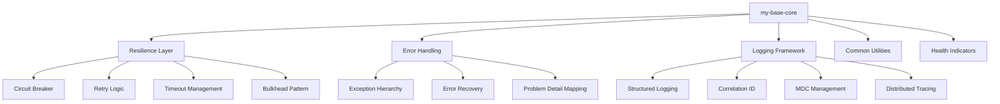

## 1. Mục tiêu (Objective)

- Cung cấp foundation layer với error handling, resilience patterns, và common utilities cho production-ready applications.
- Implement circuit breaker, retry, timeout patterns để đảm bảo system stability và fault tolerance.
- Provide structured logging với correlation ID và distributed tracing support.
- Ensure backward compatibility, performance optimization, và security best practices.

## 2. Kiến trúc/Thiết kế tổng quan (Overview)

- Kiểu: `jar` thuần; publish như library.
- Phụ thuộc chính: `spring-boot-starter`, `spring-boot-starter-validation`, `spring-boot-starter-logging`, `resilience4j-spring-boot3`, `micrometer-core`.
- Expose các lớp tiện ích, contracts, DTOs; không tự khai báo `@Configuration`.

### Core Components
- **Resilience Layer**: Circuit breaker, retry, timeout, bulkhead patterns
- **Error Handling**: Structured exceptions, error codes, recovery strategies  
- **Logging**: Structured logging với correlation ID, MDC management
- **Utilities**: Common helpers, validation, serialization
- **Health Checks**: Application health indicators

Sơ đồ kiến trúc tổng quan:



## 3. Các bước setup chi tiết (Step-by-step Setup)

1) POM và dependencies

```xml
<dependencies>
  <dependency>
    <groupId>org.springframework.boot</groupId>
    <artifactId>spring-boot-starter</artifactId>
  </dependency>
  <dependency>
    <groupId>org.springframework.boot</groupId>
    <artifactId>spring-boot-starter-validation</artifactId>
  </dependency>
  <dependency>
    <groupId>org.springframework.boot</groupId>
    <artifactId>spring-boot-starter-logging</artifactId>
  </dependency>
  <dependency>
    <groupId>io.github.resilience4j</groupId>
    <artifactId>resilience4j-spring-boot3</artifactId>
  </dependency>
  <dependency>
    <groupId>io.micrometer</groupId>
    <artifactId>micrometer-core</artifactId>
  </dependency>
  <dependency>
    <groupId>io.micrometer</groupId>
    <artifactId>micrometer-tracing-bridge-brave</artifactId>
  </dependency>
  <dependency>
    <groupId>org.springframework.boot</groupId>
    <artifactId>spring-boot-starter-actuator</artifactId>
  </dependency>
</dependencies>
```

2) Resilience Configuration

```java
@Configuration
@EnableConfigurationProperties(ResilienceProperties.class)
public class ResilienceAutoConfiguration {
    
    @Bean
    @ConditionalOnMissingBean
    public CircuitBreakerRegistry circuitBreakerRegistry() {
        return CircuitBreakerRegistry.ofDefaults();
    }
    
    @Bean
    @ConditionalOnMissingBean
    public RetryRegistry retryRegistry() {
        return RetryRegistry.ofDefaults();
    }
    
    @Bean
    @ConditionalOnMissingBean
    public TimeLimiterRegistry timeLimiterRegistry() {
        return TimeLimiterRegistry.ofDefaults();
    }
    
    @Bean
    @ConditionalOnMissingBean
    public BulkheadRegistry bulkheadRegistry() {
        return BulkheadRegistry.ofDefaults();
    }
}
```

3) Error Handling Implementation

```java
@ControllerAdvice
public class GlobalExceptionHandler {
    
    @ExceptionHandler(BusinessException.class)
    public ResponseEntity<ProblemDetail> handleBusinessException(BusinessException ex) {
        ProblemDetail problemDetail = ProblemDetail.forStatusAndDetail(
            HttpStatus.BAD_REQUEST, ex.getMessage());
        problemDetail.setTitle("Business Error");
        problemDetail.setProperty("errorCode", ex.getErrorCode());
        problemDetail.setProperty("correlationId", CorrelationIdHolder.get());
        problemDetail.setProperty("timestamp", Instant.now());
        return ResponseEntity.badRequest().body(problemDetail);
    }
    
    @ExceptionHandler(ResilienceException.class)
    public ResponseEntity<ProblemDetail> handleResilienceException(ResilienceException ex) {
        ProblemDetail problemDetail = ProblemDetail.forStatusAndDetail(
            HttpStatus.SERVICE_UNAVAILABLE, "Service temporarily unavailable");
        problemDetail.setTitle("Service Unavailable");
        problemDetail.setProperty("errorCode", "SERVICE_UNAVAILABLE");
        problemDetail.setProperty("correlationId", CorrelationIdHolder.get());
        return ResponseEntity.status(HttpStatus.SERVICE_UNAVAILABLE).body(problemDetail);
    }
}
```

4) Structured Logging Implementation

```java
@Component
public class StructuredLogger {
    
    private static final Logger logger = LoggerFactory.getLogger(StructuredLogger.class);
    
    public void logBusinessEvent(String event, Map<String, Object> context) {
        MDC.put("event", event);
        MDC.put("correlationId", CorrelationIdHolder.get());
        context.forEach((key, value) -> MDC.put(key, String.valueOf(value)));
        
        logger.info("Business event: {}", event);
        
        // Clear MDC after logging
        MDC.clear();
    }
    
    public void logError(String message, Throwable throwable, Map<String, Object> context) {
        MDC.put("error", "true");
        MDC.put("correlationId", CorrelationIdHolder.get());
        context.forEach((key, value) -> MDC.put(key, String.valueOf(value)));
        
        logger.error(message, throwable);
        MDC.clear();
    }
}
```

5) Health Indicators

```java
@Component
public class DatabaseHealthIndicator implements HealthIndicator {
    
    @Autowired
    private DataSource dataSource;
    
    @Override
    public Health health() {
        try (Connection connection = dataSource.getConnection()) {
            if (connection.isValid(1)) {
                return Health.up()
                    .withDetail("database", "Available")
                    .withDetail("validationQuery", "SELECT 1")
                    .build();
            }
        } catch (SQLException ex) {
            return Health.down()
                .withDetail("database", "Unavailable")
                .withDetail("error", ex.getMessage())
                .build();
        }
        return Health.down().withDetail("database", "Unknown error").build();
    }
}
```

6) Packaging và public API

- Group theo package: `exception`, `logging`, `validation`, `util`, `model`, `resilience`, `health`.
- Chỉ xuất public API ổn định; tránh `internal` bị dùng nhầm (đặt trong package `internal`).

## 4. Cấu hình (Configuration)

### 4.1 Resilience Properties
```yaml
base:
  core:
    resilience:
      circuit-breaker:
        failure-rate-threshold: 50
        wait-duration-in-open-state: 30s
        sliding-window-size: 10
        minimum-number-of-calls: 5
        permitted-number-of-calls-in-half-open-state: 3
      retry:
        max-attempts: 3
        wait-duration: 1s
        exponential-backoff: true
        exponential-backoff-multiplier: 2
      timeout:
        duration: 5s
      bulkhead:
        max-concurrent-calls: 25
        max-wait-duration: 1s
```

### 4.2 Logging Configuration
```yaml
base:
  core:
    logging:
      correlation-id:
        enabled: true
        header-name: X-Correlation-ID
        generate-if-missing: true
      structured:
        enabled: true
        format: json
        include-stack-trace: true
      mdc:
        enabled: true
        fields: [userId, requestId, traceId, spanId]
      performance:
        enabled: true
        slow-query-threshold: 1000ms
```

### 4.3 Error Handling Configuration
```yaml
base:
  core:
    error-handling:
      include-stack-trace: false
      include-message: true
      include-binding-errors: true
      include-exception: false
      problem-detail:
        enabled: true
        include-timestamp: true
        include-path: true
```

- Không khai báo `@Configuration` ở core; không thêm file `AutoConfiguration.imports` tại đây.
- Nếu cần tài nguyên (message bundles), đặt tại `src/main/resources` và tên không va chạm.

## 5. Cách kiểm thử/triển khai (Testing & Deployment)

### 5.1 Unit Testing
```java
@ExtendWith(MockitoExtension.class)
class ResilienceServiceTest {
    
    @Test
    void shouldHandleCircuitBreakerOpen() {
        // Test circuit breaker behavior
        CircuitBreaker circuitBreaker = CircuitBreaker.ofDefaults("test");
        circuitBreaker.transitionToOpenState();
        
        assertThat(circuitBreaker.getState()).isEqualTo(CircuitBreaker.State.OPEN);
    }
    
    @Test
    void shouldRetryOnFailure() {
        // Test retry logic
        Retry retry = Retry.ofDefaults("test");
        // Implementation test
    }
}
```

### 5.2 Integration Testing
```java
@SpringBootTest
@TestPropertySource(properties = {
    "base.core.resilience.circuit-breaker.failure-rate-threshold=100"
})
class ResilienceIntegrationTest {
    
    @Test
    void shouldOpenCircuitBreakerAfterFailures() {
        // Integration test with real circuit breaker
    }
}
```

### 5.3 Performance Testing
```java
@Test
void shouldHandleHighLoad() {
    // Load testing for resilience patterns
    // Memory usage testing
    // Response time testing
}
```

### 5.4 Deployment
- Unit test: JUnit5, AssertJ; chạy `mvn -pl my-base-core -am test`.
- Integration test: Testcontainers cho external dependencies.
- Mutation/coverage: Pitest, Jacoco với threshold 80%.
- Deploy: theo parent, artifact `my-base-core` xuất bản như library.

## 6. Lưu ý mở rộng/Best practices

### 6.1 Performance
- Use async processing cho non-blocking operations
- Implement connection pooling cho external services
- Cache frequently accessed data với appropriate TTL
- Monitor memory usage và GC patterns
- Use bulkhead pattern để isolate resources

### 6.2 Security
- Sanitize all inputs trước khi processing
- Implement rate limiting tại application level
- Use secure random cho correlation IDs
- Log security events without sensitive data
- Validate all external inputs

### 6.3 Monitoring
- Expose custom metrics cho business logic
- Implement distributed tracing
- Set up alerts cho circuit breaker state changes
- Monitor error rates và response times
- Track resource utilization

### 6.4 Reliability
- Giữ backward-compatibility ở minor; tránh thay đổi signature public
- Tránh phụ thuộc nặng; mọi phụ thuộc mới phải được đánh giá qua BOM
- Implement graceful degradation strategies
- Use timeout cho all external calls
- Implement proper retry policies với exponential backoff

## 7. Tài liệu tham khảo (References)

- Resilience4j Documentation: Circuit Breaker, Retry, Timeout patterns
- Spring Boot Actuator: Health indicators và metrics
- Micrometer Metrics: Custom metrics và monitoring
- OpenTelemetry Tracing: Distributed tracing best practices
- OWASP Security Guidelines: Input validation và security patterns
- Spring Boot Validation, ProblemDetail (Spring 6+), MDC logging best practices
