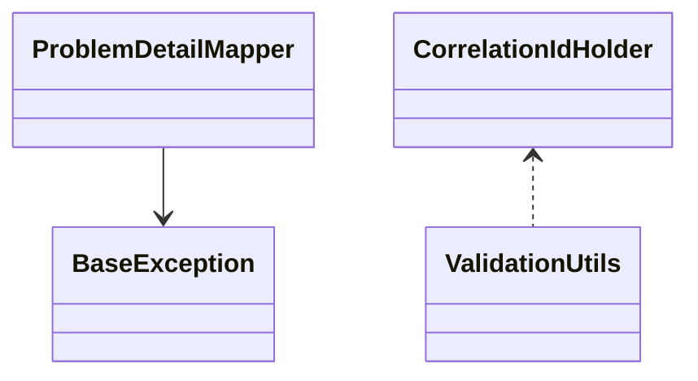

## 1. Mục tiêu (Objective)

- Cung cấp lõi dùng chung: error handling, logging, validation, common utils, cấu hình mặc định tối thiểu và nhất quán.
- Tách biệt hoàn toàn với auto-config để tránh rò rỉ bean vào ứng dụng; auto-config sẽ ở `my-base-starter`.

## 2. Kiến trúc/Thiết kế tổng quan (Overview)

- Kiểu: `jar` thuần; publish như library.
- Phụ thuộc chính: `spring-boot-starter`, `spring-boot-starter-validation`, `spring-boot-starter-logging` (được BOM quản lý).
- Expose các lớp tiện ích, contracts, DTOs; không tự khai báo `@Configuration`.

Sơ đồ lớp mức cao (ví dụ):



## 3. Các bước setup chi tiết (Step-by-step Setup)

1) POM và dependencies

```xml
<dependencies>
  <dependency>
    <groupId>org.springframework.boot</groupId>
    <artifactId>spring-boot-starter</artifactId>
  </dependency>
  <dependency>
    <groupId>org.springframework.boot</groupId>
    <artifactId>spring-boot-starter-validation</artifactId>
  </dependency>
  <dependency>
    <groupId>org.springframework.boot</groupId>
    <artifactId>spring-boot-starter-logging</artifactId>
  </dependency>
</dependencies>
```

2) Thành phần code khuyến nghị

- Exception model: `BaseException extends RuntimeException`, `ErrorCode enum`, `ProblemDetailMapper` chuyển đổi thống nhất.
- Logging: `CorrelationIdHolder` (ThreadLocal/MDC), `LoggingUtils` để log có cấu trúc.
- Validation: helper kiểm tra input, message bundle; annotation tuỳ chọn.
- Common utils: `TimeUtils`, `StringUtilsExt`, `CollectionsExt`, `IdempotencyKeyGenerator`.
- Properties: lớp `CoreProperties` với `@ConfigurationProperties(prefix="base.core")` (enable tại starter).

3) Packaging và public API

- Group theo package: `exception`, `logging`, `validation`, `util`, `model`.
- Chỉ xuất public API ổn định; tránh `internal` bị dùng nhầm (đặt trong package `internal`).

## 4. Cấu hình (Configuration)

- Không khai báo `@Configuration` ở core; không thêm file `AutoConfiguration.imports` tại đây.
- Nếu cần tài nguyên (message bundles), đặt tại `src/main/resources` và tên không va chạm.

## 5. Cách kiểm thử/triển khai (Testing & Deployment)

- Unit test: JUnit5, AssertJ; chạy `mvn -pl my-base-core -am test`.
- Mutation/coverage (tuỳ chọn): Pitest, Jacoco.
- Deploy: theo parent, artifact `my-base-core` xuất bản như library.

## 6. Lưu ý mở rộng/Best practices

- Giữ backward-compatibility ở minor; tránh thay đổi signature public.
- Tránh phụ thuộc nặng; mọi phụ thuộc mới phải được đánh giá qua BOM.
- Tài liệu hoá contracts và ví dụ sử dụng trong Javadoc.

## 7. Tài liệu tham khảo (References)

- Spring Boot Validation, ProblemDetail (Spring 6+), MDC logging best practices.
