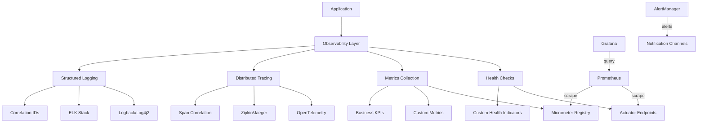

## 1. Mục tiêu (Objective)

- Chuẩn hoá observability platform enterprise-grade: health checks, metrics, distributed tracing, logging, và alerting.
- Implement comprehensive monitoring với custom metrics, business KPIs, và performance indicators.
- Cung cấp real-time insights, proactive alerting, và root cause analysis capabilities.
- Đảm bảo compliance với monitoring standards và best practices cho production environments.

## 2. Kiến trúc/Thiết kế tổng quan (Overview)

- Kiểu: `jar` optional (pure library: helpers/constants/properties). Wiring được thực hiện ở `java-base-starter`.
- Phụ thuộc: `micrometer-core` (library), không kéo `actuator`/registry trong lib. Ở starter: `spring-boot-starter-actuator`, `micrometer-registry-prometheus`, `micrometer-tracing-bridge-otel`, `opentelemetry-exporter-otlp`.
- Cung cấp: conventions/metrics names/helpers; auto-configuration, health indicators, registry selection nằm ở starter.

### Observability Components
- **Health Checks**: Application health, dependencies, custom health indicators
- **Metrics**: JVM, application, business metrics với multiple registries
- **Distributed Tracing**: Request tracing, span correlation, performance analysis
- **Logging**: Structured logging, log aggregation, correlation IDs
- **Alerting**: Threshold-based alerts, anomaly detection, notification channels
- **Dashboards**: Grafana integration, custom visualizations

Sơ đồ observability architecture:



## 3. Các bước setup chi tiết (Step-by-step Setup)

1) POM và dependencies:

```xml
<dependencies>
  <!-- Library: keep minimal -->
  <dependency>
    <groupId>io.micrometer</groupId>
    <artifactId>micrometer-core</artifactId>
  </dependency>
</dependencies>
```

2) Custom Health Indicators

```java
@Component
public class DatabaseHealthIndicator implements HealthIndicator {
    
    @Autowired
    private DataSource dataSource;
    
    @Override
    public Health health() {
        try (Connection connection = dataSource.getConnection()) {
            if (connection.isValid(1)) {
                return Health.up()
                    .withDetail("database", "Available")
                    .withDetail("validationQuery", "SELECT 1")
                    .withDetail("responseTime", measureResponseTime())
                    .build();
            }
        } catch (SQLException ex) {
            return Health.down()
                .withDetail("database", "Unavailable")
                .withDetail("error", ex.getMessage())
                .withDetail("timestamp", Instant.now())
                .build();
        }
        return Health.down().withDetail("database", "Unknown error").build();
    }
}

@Component
public class ExternalServiceHealthIndicator implements HealthIndicator {
    
    @Override
    public Health health() {
        try {
            // Check external service health
            ResponseEntity<String> response = restTemplate.getForEntity("/health", String.class);
            if (response.getStatusCode().is2xxSuccessful()) {
                return Health.up()
                    .withDetail("external-service", "Available")
                    .withDetail("responseTime", response.getHeaders().getFirst("X-Response-Time"))
                    .build();
            }
        } catch (Exception ex) {
            return Health.down()
                .withDetail("external-service", "Unavailable")
                .withDetail("error", ex.getMessage())
                .build();
        }
        return Health.down().withDetail("external-service", "Unknown error").build();
    }
}
```

3) Custom Metrics Implementation

```java
@Component
public class BusinessMetricsCollector {
    
    private final MeterRegistry meterRegistry;
    private final Counter orderCounter;
    private final Timer orderProcessingTimer;
    private final Gauge activeUsersGauge;
    
    public BusinessMetricsCollector(MeterRegistry meterRegistry) {
        this.meterRegistry = meterRegistry;
        this.orderCounter = Counter.builder("orders.total")
            .description("Total number of orders")
            .tag("environment", "production")
            .register(meterRegistry);
        
        this.orderProcessingTimer = Timer.builder("orders.processing.time")
            .description("Order processing time")
            .register(meterRegistry);
        
        this.activeUsersGauge = Gauge.builder("users.active")
            .description("Number of active users")
            .register(meterRegistry, this, BusinessMetricsCollector::getActiveUsers);
    }
    
    public void recordOrder(String orderType, double amount) {
        orderCounter.increment(Tags.of("type", orderType, "amount_range", getAmountRange(amount)));
    }
    
    public void recordOrderProcessingTime(Duration duration) {
        orderProcessingTimer.record(duration);
    }
    
    private double getActiveUsers() {
        // Return current active users count
        return userService.getActiveUsersCount();
    }
}
```

4) Distributed Tracing Configuration (ở starter, ưu tiên OpenTelemetry)

```java
@AutoConfiguration
@ConditionalOnClass(name = "io.opentelemetry.api.trace.Tracer")
@ConditionalOnProperty(prefix = "base.observability.tracing", name = "enabled", havingValue = "true", matchIfMissing = true)
public class OTelTracingAutoConfiguration {
    // Micrometer Tracing picks up OTel SDK/OTLP exporter on classpath; usually no custom beans required
}
```

5) Structured Logging Configuration

```java
@Component
public class StructuredLogger {
    
    private static final Logger logger = LoggerFactory.getLogger(StructuredLogger.class);
    
    public void logBusinessEvent(String event, Map<String, Object> context) {
        MDC.put("event", event);
        MDC.put("correlationId", CorrelationIdHolder.get());
        MDC.put("userId", getCurrentUserId());
        context.forEach((key, value) -> MDC.put(key, String.valueOf(value)));
        
        logger.info("Business event: {}", event);
        MDC.clear();
    }
    
    public void logPerformanceMetric(String operation, Duration duration, Map<String, Object> context) {
        MDC.put("operation", operation);
        MDC.put("duration", duration.toMillis());
        MDC.put("correlationId", CorrelationIdHolder.get());
        context.forEach((key, value) -> MDC.put(key, String.valueOf(value)));
        
        logger.info("Performance metric: {} took {}ms", operation, duration.toMillis());
        MDC.clear();
    }
}
```

6) Endpoint và security (ở starter)

```yaml
management:
  endpoints:
    web:
      exposure:
        include: "health,info,metrics,prometheus"
  endpoint:
    health:
      show-details: when_authorized
      show-components: always
    metrics:
      enabled: true
    prometheus:
      enabled: true
  health:
    defaults:
      enabled: true
    db:
      enabled: true
    redis:
      enabled: true
  metrics:
    export:
      prometheus:
        enabled: true
        step: 30s
    distribution:
      percentiles-histogram:
        http.server.requests: true
      percentiles:
        http.server.requests: 0.5, 0.95, 0.99
  tracing:
    sampling:
      probability: 0.1
  otlp:
    tracing:
      endpoint: ${OTEL_EXPORTER_OTLP_ENDPOINT:http://otel-collector:4317}
```

## 4. Cấu hình (Configuration)

### 4.1 Prometheus Configuration
```yaml
base:
  observability:
    prometheus:
      enabled: true
      scrape-interval: 30s
      metrics-path: /actuator/prometheus
      retention-time: 15d
    alerting:
      enabled: true
      rules:
        - alert: HighErrorRate
          expr: rate(http_server_requests_seconds_count{status=~"5.."}[5m]) > 0.1
          for: 2m
          labels:
            severity: critical
          annotations:
            summary: "High error rate detected"
```

### 4.2 Distributed Tracing Configuration (OTLP)
```yaml
base:
  observability:
    tracing:
      enabled: true
      sampling-probability: 0.1
      otlp:
        endpoint: ${OTEL_EXPORTER_OTLP_ENDPOINT:http://otel-collector:4317}
      correlation:
        enabled: true
        header-name: X-Correlation-ID
```

### 4.3 Logging Configuration
```yaml
base:
  observability:
    logging:
      structured: true
      format: json
      correlation-id:
        enabled: true
        header-name: X-Correlation-ID
      performance:
        enabled: true
        slow-query-threshold: 1000ms
        slow-request-threshold: 2000ms
```

### 4.4 Alerting Configuration
```yaml
base:
  observability:
    alerting:
      channels:
        - type: email
          recipients: ["admin@company.com"]
        - type: slack
          webhook: ${SLACK_WEBHOOK_URL}
        - type: pagerduty
          integration-key: ${PAGERDUTY_KEY}
      rules:
        - name: "High CPU Usage"
          condition: "system_cpu_usage > 0.8"
          duration: "5m"
          severity: "warning"
        - name: "Memory Leak"
          condition: "jvm_memory_used_bytes / jvm_memory_max_bytes > 0.9"
          duration: "10m"
          severity: "critical"
```

## 5. Cách kiểm thử/triển khai (Testing & Deployment)

### 5.1 Health Check Testing
```bash
# Basic health check
curl http://localhost:8080/actuator/health

# Detailed health check
curl http://localhost:8080/actuator/health/db
curl http://localhost:8080/actuator/health/redis
```

### 5.2 Metrics Testing
```bash
# Prometheus metrics
curl http://localhost:8080/actuator/prometheus

# Custom metrics
curl http://localhost:8080/actuator/metrics/orders.total
curl http://localhost:8080/actuator/metrics/orders.processing.time
```

### 5.3 Tracing Testing
```bash
# Test with correlation ID header flowing through traces/logs
curl -H "X-Correlation-ID: test-123" http://localhost:8080/api/test
```

### 5.4 Integration Testing
```java
@SpringBootTest
@Testcontainers
class ObservabilityIntegrationTest {
    
    @Container
    static GenericContainer<?> prometheus = new GenericContainer<>("prom/prometheus")
            .withExposedPorts(9090);
    
    @Container
    static GenericContainer<?> zipkin = new GenericContainer<>("openzipkin/zipkin")
            .withExposedPorts(9411);
    
    @Test
    void shouldExposeHealthEndpoints() {
        ResponseEntity<String> response = restTemplate.getForEntity("/actuator/health", String.class);
        assertThat(response.getStatusCode()).isEqualTo(HttpStatus.OK);
    }
    
    @Test
    void shouldExposeMetrics() {
        ResponseEntity<String> response = restTemplate.getForEntity("/actuator/prometheus", String.class);
        assertThat(response.getStatusCode()).isEqualTo(HttpStatus.OK);
        assertThat(response.getBody()).contains("jvm_memory_used_bytes");
    }
}
```

### 5.5 Performance Testing
```java
@Test
void shouldHandleHighMetricsVolume() {
    // Test metrics collection under load
    int iterations = 10000;
    long startTime = System.currentTimeMillis();
    
    for (int i = 0; i < iterations; i++) {
        businessMetricsCollector.recordOrder("test", 100.0);
    }
    
    long duration = System.currentTimeMillis() - startTime;
    assertThat(duration).isLessThan(5000); // Should complete within 5 seconds
}
```

### 5.6 Deployment
- Kiểm thử: `curl /actuator/health`, `curl /actuator/prometheus`, `curl /actuator/tracing`.
- Triển khai: expose `/actuator` qua ingress/gateway có auth; không public toàn bộ.
- Monitoring: Set up Prometheus scraping, Grafana dashboards, AlertManager rules.

## 6. Lưu ý mở rộng/Best practices

### 6.1 Security Best Practices
- **Access Control**: Giới hạn IP/Basic auth/Token cho actuator; không bật endpoints nhạy cảm.
- **Data Privacy**: Không log sensitive data (PII, passwords, tokens).
- **Network Security**: Use TLS cho all observability endpoints.
- **Authentication**: Implement proper authentication cho monitoring tools.

### 6.2 Performance Optimization
- **Metrics Collection**: Đừng đăng ký quá nhiều meter binders; optimize metric collection frequency.
- **Tracing Sampling**: Sampling thấp cho tracing (0.1-1%) để giảm overhead.
- **Log Aggregation**: Use async logging, batch log shipping.
- **Storage**: Implement retention policies cho metrics và logs.

### 6.3 Scalability Considerations
- **Centralized Monitoring**: Centralize Prometheus; dùng Alertmanager cho cảnh báo.
- **Distributed Tracing**: Use sampling và aggregation cho high-volume systems.
- **Log Management**: Implement log sharding và rotation.
- **Metrics Federation**: Use Prometheus federation cho multi-cluster monitoring.

### 6.4 Alerting & Incident Response
- **Alert Fatigue**: Avoid alert fatigue với proper thresholds và grouping.
- **Escalation Policies**: Implement escalation policies cho critical alerts.
- **Runbooks**: Maintain runbooks cho common incidents.
- **Post-mortem**: Conduct post-mortems để improve monitoring.

### 6.5 Compliance & Governance
- **Data Retention**: Implement proper data retention policies.
- **Audit Logging**: Log all monitoring access và configuration changes.
- **Compliance**: Ensure monitoring meets regulatory requirements.
- **Documentation**: Maintain comprehensive monitoring documentation.

## 7. Tài liệu tham khảo (References)

- **Spring Boot Actuator**: Health checks, metrics, management endpoints
- **Micrometer**: Application metrics, multiple registry support
- **Prometheus**: Time-series database, query language, alerting
- **Grafana**: Visualization, dashboards, alerting
- **OpenTelemetry**: Distributed tracing, observability standards
- **Zipkin/Jaeger**: Distributed tracing backends
- **ELK Stack**: Elasticsearch, Logstash, Kibana for log management
- **AlertManager**: Alert routing, grouping, silencing

