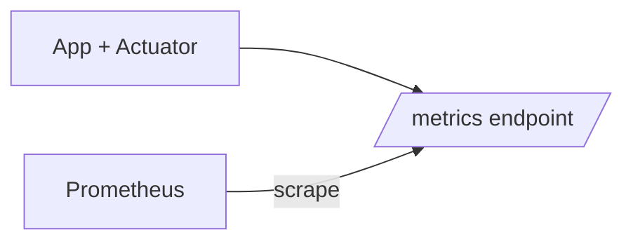

## 1. Mục tiêu (Objective)

- Chuẩn hoá quan sát hệ thống: health, metrics, tracing (nếu cần), xuất Prometheus; cấu hình an toàn và mở rộng.

## 2. Kiến trúc/Thiết kế tổng quan (Overview)

- Kiểu: `jar` optional. Phụ thuộc: `spring-boot-starter-actuator`, `micrometer-core`, `micrometer-registry-prometheus` (tuỳ chọn).
- Cung cấp: cấu hình mặc định cho actuator và micrometer qua starter; module này chứa constants/properties và helpers.

Sơ đồ thu thập metrics:



## 3. Các bước setup chi tiết (Step-by-step Setup)

1) POM và dependencies:

```xml
<dependencies>
  <dependency>
    <groupId>org.springframework.boot</groupId>
    <artifactId>spring-boot-starter-actuator</artifactId>
  </dependency>
  <dependency>
    <groupId>io.micrometer</groupId>
    <artifactId>micrometer-core</artifactId>
  </dependency>
  <dependency>
    <groupId>io.micrometer</groupId>
    <artifactId>micrometer-registry-prometheus</artifactId>
    <optional>true</optional>
  </dependency>
</dependencies>
```

2) Endpoint và security (ở starter)

```yaml
management:
  endpoints:
    web:
      exposure:
        include: "health,info,prometheus,metrics"
  endpoint:
    health:
      show-details: when_authorized
```

3) Prometheus scrape (ví dụ docker-compose):

```yaml
prometheus:
  image: prom/prometheus
  ports: ["9090:9090"]
  volumes:
    - ./prometheus.yml:/etc/prometheus/prometheus.yml
```

## 4. Cấu hình (Configuration)

- Bật registry theo property: `management.metrics.export.prometheus.enabled=true`.
- Sampling/tracing (nếu dùng): `management.tracing.sampling.probability=0.1`.

## 5. Cách kiểm thử/triển khai (Testing & Deployment)

- Kiểm thử: `curl /actuator/health`, `curl /actuator/prometheus`.
- Triển khai: expose `/actuator` qua ingress/gateway có auth; không public toàn bộ.

## 6. Lưu ý mở rộng/Best practices

- Security: giới hạn IP/Basic auth/Token cho actuator; không bật endpoints nhạy cảm.
- Performance: đừng đăng ký quá nhiều meter binders; sampling thấp cho tracing.
- Scalability: centralize Prometheus; dùng Alertmanager cho cảnh báo.

## 7. Tài liệu tham khảo (References)

- Spring Boot Actuator, Micrometer, Prometheus Operator.

