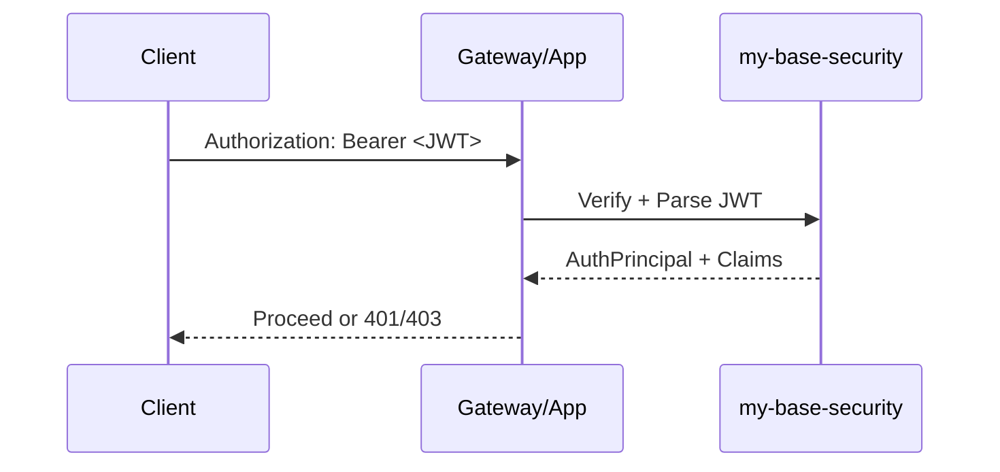

## 1. Mục tiêu (Objective)

- Cung cấp nền tảng bảo mật dùng chung cho các ứng dụng dựa trên Spring Security + JWT, không ép buộc policy đặc thù ứng dụng.
- Định nghĩa contracts, DTOs, và tiện ích xử lý token; auto-config và policy đặt ở starter để tránh xung đột.

## 2. Kiến trúc/Thiết kế tổng quan (Overview)

- Kiểu: `jar` (library). Phụ thuộc: `spring-boot-starter-security`, JWT lib (jjwt hoặc nimbus-jose-jwt, quản lý bởi BOM).
- Cung cấp building blocks: providers, verifiers, principal, filters và helpers. Không tự đăng ký `SecurityFilterChain` ở module này.

Sơ đồ luồng xác thực (mức cao):



## 3. Các bước setup chi tiết (Step-by-step Setup)

1) POM và dependencies (trong `my-base-security`):

```xml
<dependencies>
  <dependency>
    <groupId>org.springframework.boot</groupId>
    <artifactId>spring-boot-starter-security</artifactId>
  </dependency>
  <dependency>
    <groupId>io.jsonwebtoken</groupId>
    <artifactId>jjwt-api</artifactId>
  </dependency>
  <!-- chọn jjwt-impl + jjwt-jackson ở runtime trong app hoặc starter -->
</dependencies>
```

2) Thành phần code

- Contracts: `TokenProvider` (issue), `TokenVerifier` (verify), `SecurityContextFacade` (get/set principal).
- DTOs: `AuthPrincipal` (id, roles, attributes), `JwtClaims`.
- Utilities: `JwtUtils` (parse, clockSkew, keyResolver), `CryptoUtils` (tuỳ chọn).

3) Ví dụ sử dụng (ở app hoặc starter):

```java
@Bean
SecurityFilterChain securityFilterChain(HttpSecurity http, JwtAuthenticationFilter jwtFilter) throws Exception {
  return http.csrf(csrf -> csrf.disable())
    .authorizeHttpRequests(reg -> reg
      .requestMatchers("/health").permitAll()
      .anyRequest().authenticated())
    .addFilterBefore(jwtFilter, UsernamePasswordAuthenticationFilter.class)
    .build();
}
```

## 4. Cấu hình (Configuration)

- Properties mẫu (enable ở starter):

```yaml
base:
  security:
    jwt:
      issuer: mycorp
      audience: myapps
      public-key-pem: ${JWT_PUBLIC_PEM}
      clock-skew-seconds: 60
```

- Tách bạch: module security không tự đọc properties; chỉ định nghĩa classes/records.

## 5. Cách kiểm thử/triển khai (Testing & Deployment)

- Unit test: verify/parse JWT, clock skew, invalid signature.
- Integration test (ở starter/app): khởi tạo `SecurityFilterChain` và test endpoints 200/401/403.
- Deploy: theo parent, artifact `my-base-security` publish như library.

## 6. Lưu ý mở rộng/Best practices

- Security: hạn chế log token; chỉ log jti/subject đã mask. Xoay khoá định kỳ.
- Scalability: Stateless JWT; cân nhắc revoke list qua Redis nếu cần.
- Performance: sử dụng `NimbusJwtDecoder` hoặc `jjwt` với cache key resolver.

## 7. Tài liệu tham khảo (References)

- Spring Security 6, JWT best practices (IETF RFC 7519), OWASP JWT Cheat Sheet.

