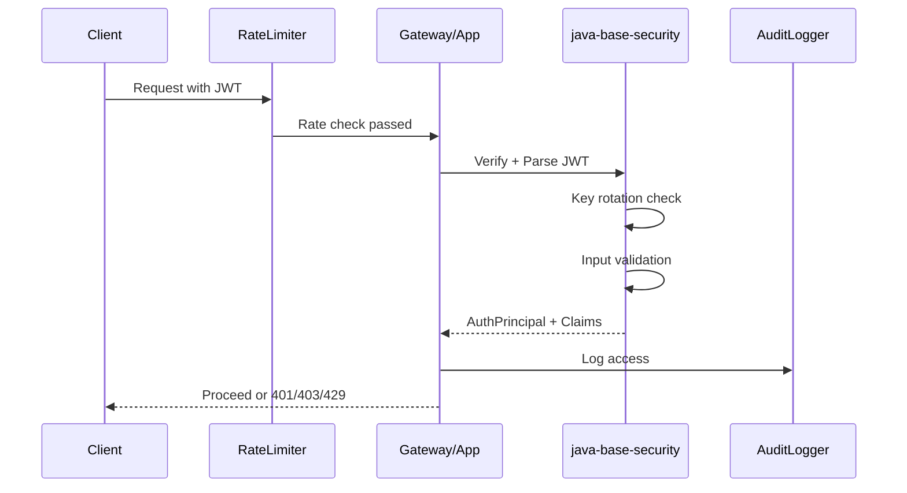

## 1. Mục tiêu (Objective)

- Cung cấp nền tảng bảo mật enterprise-grade với Spring Security + JWT, bao gồm key rotation, rate limiting, và input validation.
- Implement security best practices: OWASP compliance, secure headers, audit logging, và threat protection.
- Định nghĩa contracts, DTOs, và tiện ích xử lý token với auto-config và policy đặt ở starter để tránh xung đột.
- Đảm bảo compliance với security standards và regulations.

## 2. Kiến trúc/Thiết kế tổng quan (Overview)

- Kiểu: `jar` (pure library). KHÔNG khai báo Spring bean/filter chain trong module này.
- Phụ thuộc: JWT lib ưu tiên `nimbus-jose-jwt` (hoặc `spring-security-oauth2-jose`), các contracts/helpers. Spring Security và wiring để starter quản lý.
- Cung cấp building blocks: token verifier interfaces, principal model, claim mappers, rate limit contracts; `SecurityFilterChain` sẽ được định nghĩa ở starter.

### Security Components
- **Authentication**: JWT token validation, key rotation, clock skew handling
- **Authorization**: Role-based access control, permission management
- **Rate Limiting**: Request throttling, brute force protection
- **Input Validation**: XSS protection, SQL injection prevention
- **Audit Logging**: Security events, access logs, compliance tracking
- **Secure Headers**: CSP, HSTS, X-Frame-Options, etc.

Sơ đồ luồng xác thực enhanced:



## 3. Các bước setup chi tiết (Step-by-step Setup)

1) POM và dependencies (trong `java-base-security`, tối ưu cho library):

```xml
<dependencies>
  <dependency>
    <groupId>com.nimbusds</groupId>
    <artifactId>nimbus-jose-jwt</artifactId>
  </dependency>
  <dependency>
    <groupId>org.owasp.encoder</groupId>
    <artifactId>encoder</artifactId>
  </dependency>
  <dependency>
    <groupId>io.github.bucket4j</groupId>
    <artifactId>bucket4j-core</artifactId>
  </dependency>
</dependencies>
```

2) Key Rotation/JWKS Resolution (contracts, không phụ thuộc Spring)

```java
public interface JwksResolver {
    Optional<RSAKey> resolveByKeyId(String kid);
    Duration getCacheTtl();
}

public final class RemoteJwksResolver implements JwksResolver {
    private final URI jwksUri;
    private final Duration cacheTtl;
    private volatile JWKSet cachedSet;

    public RemoteJwksResolver(URI jwksUri, Duration cacheTtl) { this.jwksUri = jwksUri; this.cacheTtl = cacheTtl; }
    public Optional<RSAKey> resolveByKeyId(String kid) { /* fetch & cache JWKS, then find by kid */ return Optional.empty(); }
    public Duration getCacheTtl() { return cacheTtl; }
}
```

3) Rate Limiting Contracts (library) và triển khai phân tán ở starter

```java
public interface RateLimiterService {
    boolean isAllowed(String key, int requests, Duration window);
    void reset(String key);
}

// Ở starter: triển khai Redis/Bucket4j-distributed để hỗ trợ multi-instance.
```

4) Input Validation & Sanitization (library utility)

```java
public class InputSanitizer {
    
    public String sanitizeHtml(String input) {
        return Encoders.forHtml().encode(input);
    }
    
    public String sanitizeJavaScript(String input) {
        return Encoders.forJavaScript().encode(input);
    }
    
    public String sanitizeUrl(String input) {
        return Encoders.forUriComponent().encode(input);
    }
    
    @Valid
    public void validateInput(@NotBlank @Size(max = 255) String input) {
        // Validation logic
    }
}
```

5) Audit Logging (library)

```java
public final class SecurityAuditLogger {
    
    private static final Logger auditLogger = LoggerFactory.getLogger("SECURITY_AUDIT");
    
    public static void logAuthenticationSuccess(String userId, String ipAddress) {
        auditLogger.info("Authentication success: userId={}, ip={}, timestamp={}", 
            userId, ipAddress, Instant.now());
    }
    
    public static void logAuthenticationFailure(String userId, String ipAddress, String reason) {
        auditLogger.warn("Authentication failure: userId={}, ip={}, reason={}, timestamp={}", 
            userId, ipAddress, reason, Instant.now());
    }
    
    public static void logAuthorizationFailure(String userId, String resource, String action) {
        auditLogger.warn("Authorization failure: userId={}, resource={}, action={}, timestamp={}", 
            userId, resource, action, Instant.now());
    }
}
```

6) Enhanced Security Filter Chain (ở starter): Nimbus + JWKS + headers + rate limit (Redis)

```java
@Bean
SecurityFilterChain securityFilterChain(HttpSecurity http,
                                       JwtAuthenticationFilter jwtFilter,
                                       RateLimitingFilter rateLimitingFilter) throws Exception {
  return http
    .csrf(AbstractHttpConfigurer::disable)
    .headers(h -> h
      .contentSecurityPolicy(csp -> csp.policyDirectives("default-src 'self'"))
      .frameOptions(FrameOptionsConfig::deny)
      .httpStrictTransportSecurity(hsts -> hsts.includeSubDomains(true).maxAgeInSeconds(31536000)))
    .authorizeHttpRequests(reg -> reg
      .requestMatchers("/actuator/health", "/actuator/info").permitAll()
      .requestMatchers("/api/admin/**").hasRole("ADMIN")
      .anyRequest().authenticated())
    .addFilterBefore(rateLimitingFilter, UsernamePasswordAuthenticationFilter.class)
    .addFilterBefore(jwtFilter, UsernamePasswordAuthenticationFilter.class)
    .exceptionHandling(ex -> ex
      .authenticationEntryPoint(customAuthenticationEntryPoint())
      .accessDeniedHandler(customAccessDeniedHandler()))
    .build();
}
```

## 4. Cấu hình (Configuration)

### 4.1 JWT Configuration (JWKS + Nimbus)
```yaml
base:
  security:
    jwt:
      issuer: mycorp
      audience: myapps
      jwks-uri: ${JWT_JWKS_URI}
      clock-skew-seconds: 60
      key-rotation:
        enabled: true
        rotation-interval: 24h
        grace-period: 1h
        key-size: 2048
      token-validation:
        validate-issuer: true
        validate-audience: true
        validate-expiration: true
        validate-not-before: true
```

### 4.2 Rate Limiting Configuration (distributed)
```yaml
base:
  security:
    rate-limiting:
      enabled: true
      default-limit: 100
      default-window: 1m
      backend: redis
      limits:
        login:
          requests: 5
          window: 1m
        api:
          requests: 1000
          window: 1h
        admin:
          requests: 10000
          window: 1h
```

### 4.3 Security Headers Configuration
```yaml
base:
  security:
    headers:
      content-security-policy: "default-src 'self'; script-src 'self' 'unsafe-inline'"
      x-frame-options: DENY
      x-content-type-options: nosniff
      x-xss-protection: "1; mode=block"
      strict-transport-security:
        max-age: 31536000
        include-subdomains: true
        preload: true
```

### 4.4 Audit Logging Configuration
```yaml
base:
  security:
    audit:
      enabled: true
      log-level: INFO
      include-request-details: true
      include-response-details: false
      sensitive-headers: [Authorization, Cookie, X-API-Key]
      log-failures-only: false
```

- Tách bạch: module security không tự đọc properties; chỉ định nghĩa classes/records.

## 5. Cách kiểm thử/triển khai (Testing & Deployment)

### 5.1 Security Testing
```java
@ExtendWith(MockitoExtension.class)
class SecurityServiceTest {
    
    @Test
    void shouldValidateJwtToken() {
        // Test JWT validation logic
        String token = generateValidToken();
        assertThat(jwtValidator.validate(token)).isTrue();
    }
    
    @Test
    void shouldRejectExpiredToken() {
        // Test expired token handling
        String expiredToken = generateExpiredToken();
        assertThat(jwtValidator.validate(expiredToken)).isFalse();
    }
    
    @Test
    void shouldEnforceRateLimit() {
        // Test rate limiting
        String identifier = "test-user";
        for (int i = 0; i < 5; i++) {
            assertThat(rateLimiter.isAllowed(identifier, 5, Duration.ofMinutes(1))).isTrue();
        }
        assertThat(rateLimiter.isAllowed(identifier, 5, Duration.ofMinutes(1))).isFalse();
    }
}
```

### 5.2 Penetration Testing
```java
@Test
void shouldPreventXSS() {
    String maliciousInput = "<script>alert('xss')</script>";
    String sanitized = inputSanitizer.sanitizeHtml(maliciousInput);
    assertThat(sanitized).doesNotContain("<script>");
}

@Test
void shouldPreventSQLInjection() {
    String maliciousInput = "'; DROP TABLE users; --";
    // Test SQL injection prevention
}
```

### 5.3 Integration Testing (starter wiring)
```java
@SpringBootTest
@TestPropertySource(properties = {
    "base.security.rate-limiting.enabled=true",
    "base.security.jwt.key-rotation.enabled=true"
})
class SecurityIntegrationTest {
    
    @Test
    void shouldEnforceSecurityHeaders() {
        // Test security headers are present
        ResponseEntity<String> response = restTemplate.getForEntity("/api/test", String.class);
        assertThat(response.getHeaders().get("X-Frame-Options")).contains("DENY");
    }
}
```

### 5.4 Deployment
- Unit test: verify/parse JWT, clock skew, invalid signature, rate limiting.
- Integration test: khởi tạo `SecurityFilterChain` và test endpoints 200/401/403/429.
- Security testing: XSS, SQL injection, CSRF protection.
- Deploy: theo parent, artifact `java-base-security` publish như library.

## 6. Lưu ý mở rộng/Best practices

### 6.1 Security Best Practices
- **Token Security**: Hạn chế log token; chỉ log jti/subject đã mask. Xoay khoá định kỳ.
- **Input Validation**: Sanitize tất cả user inputs, validate against whitelist patterns.
- **Rate Limiting**: Implement progressive rate limiting (exponential backoff).
- **Audit Logging**: Log tất cả security events, maintain compliance records.
- **Secure Headers**: Always include security headers, use HSTS preload.

### 6.2 Performance Optimization
- **JWT Caching**: Sử dụng `NimbusJwtDecoder` hoặc `jjwt` với cache key resolver.
- **Rate Limiter**: Use distributed rate limiting (Redis) cho multi-instance deployments.
- **Key Rotation**: Cache public keys, minimize key lookup overhead.
- **Async Processing**: Use async cho audit logging và non-critical security operations.

### 6.3 Scalability Considerations
- **Stateless JWT**: Design for horizontal scaling, avoid server-side session storage.
- **Token Revocation**: Cân nhắc revoke list qua Redis nếu cần immediate revocation.
- **Distributed Rate Limiting**: Use Redis hoặc database-backed rate limiting.
- **Key Distribution**: Implement secure key distribution mechanism cho multi-service.

### 6.4 Compliance & Monitoring
- **OWASP Compliance**: Follow OWASP Top 10 guidelines.
- **Security Monitoring**: Monitor failed authentication attempts, unusual patterns.
- **Compliance Logging**: Maintain audit trails cho regulatory compliance.
- **Incident Response**: Implement automated threat detection và response.

## 7. Tài liệu tham khảo (References)

- **Spring Security 6**: Authentication, Authorization, Security Headers
- **JWT Best Practices**: IETF RFC 7519, OWASP JWT Cheat Sheet
- **OWASP Security Guidelines**: Top 10, Input Validation, XSS Prevention
- **Rate Limiting**: Bucket4j Documentation, Token Bucket Algorithm
- **Key Management**: NIST SP 800-57, Key Rotation Best Practices
- **Security Headers**: OWASP Secure Headers Project, CSP Guidelines
- **Audit Logging**: NIST SP 800-92, Security Event Logging

