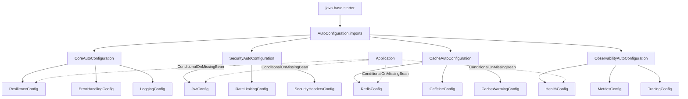

## 1. Mục tiêu (Objective)

- Cung cấp Spring Boot starter enterprise-grade để ứng dụng chỉ cần thêm một dependency là có cấu hình mặc định cho core, security, cache, observability một cách an toàn, không xung đột.
- Implement production-ready auto-configuration với proper conditional loading, graceful degradation, và comprehensive monitoring.
- Đảm bảo zero-configuration experience cho developers while maintaining flexibility cho customization.

## 2. Kiến trúc/Thiết kế tổng quan (Overview)

- Kiểu: `jar` (starter). Phụ thuộc: `java-base-core`, `java-base-security`, `java-base-cache`, `java-base-observability`, `spring-boot-autoconfigure`.
- Chứa: các lớp `@AutoConfiguration` có điều kiện, `AutoConfiguration.imports`, metadata cho properties.
- Phân tách rõ: libraries (core/security/cache/observability) KHÔNG khai báo bean; starter chịu trách nhiệm wiring auto-config.
- Tracing/metrics dùng Micrometer + OpenTelemetry (OTLP) khi có trên classpath.

### Starter Components
- **Core Auto-configuration**: Error handling, resilience, logging, validation
- **Security Auto-configuration**: JWT, rate limiting, security headers, audit logging
- **Cache Auto-configuration**: Redis, Caffeine, multi-level caching
- **Observability Auto-configuration**: Health checks, metrics, tracing, structured logging
- **Conditional Loading**: Smart auto-configuration based on classpath và properties

Sơ đồ auto-configuration flow:



## 3. Các bước setup chi tiết (Step-by-step Setup)

1) POM và dependencies

```xml
<dependencies>
  <dependency>
    <groupId>io.github.tmshoangnam</groupId>
    <artifactId>java-base-core</artifactId>
  </dependency>
  <dependency>
    <groupId>io.github.tmshoangnam</groupId>
    <artifactId>java-base-security</artifactId>
    <optional>true</optional>
  </dependency>
  <dependency>
    <groupId>io.github.tmshoangnam</groupId>
    <artifactId>java-base-cache</artifactId>
    <optional>true</optional>
  </dependency>
  <dependency>
    <groupId>io.github.tmshoangnam</groupId>
    <artifactId>java-base-observability</artifactId>
    <optional>true</optional>
  </dependency>
  <dependency>
    <groupId>org.springframework.boot</groupId>
    <artifactId>spring-boot-autoconfigure</artifactId>
  </dependency>
  <dependency>
    <groupId>org.springframework.boot</groupId>
    <artifactId>spring-boot-configuration-processor</artifactId>
    <optional>true</optional>
  </dependency>
</dependencies>
```

2) Core Auto-configuration

```java
@AutoConfiguration
@ConditionalOnClass(name = "org.springframework.boot.SpringApplication")
@EnableConfigurationProperties({CoreProperties.class, ResilienceProperties.class})
@ConditionalOnProperty(prefix = "base", name = "enabled", havingValue = "true", matchIfMissing = true)
@ConditionalOnProperty(prefix = "base.core", name = "enabled", havingValue = "true", matchIfMissing = true)
public class CoreAutoConfiguration {
  
  @Bean
  @ConditionalOnMissingBean
  public ProblemDetailMapper problemDetailMapper() { 
    return new ProblemDetailMapper(); 
  }
  
  @Bean
  @ConditionalOnMissingBean
  public StructuredLogger structuredLogger() {
    return new StructuredLogger();
  }
  
  @Bean
  @ConditionalOnWebApplication
  @ConditionalOnMissingBean
  public GlobalExceptionHandler globalExceptionHandler() {
    return new GlobalExceptionHandler();
  }
}
```

3) Security Auto-configuration

```java
@AutoConfiguration
@ConditionalOnWebApplication
@ConditionalOnClass(name = "org.springframework.security.config.annotation.web.configuration.EnableWebSecurity")
@EnableConfigurationProperties(SecurityProperties.class)
@ConditionalOnProperty(prefix = "base", name = "enabled", havingValue = "true", matchIfMissing = true)
@ConditionalOnProperty(prefix = "base.security", name = "enabled", havingValue = "true", matchIfMissing = true)
public class SecurityAutoConfiguration {
  
  @Bean
  @ConditionalOnMissingBean
  public JwtAuthenticationFilter jwtAuthenticationFilter() {
    return new JwtAuthenticationFilter();
  }
  
  @Bean
  @ConditionalOnMissingBean
  public RateLimitingFilter rateLimitingFilter() {
    return new RateLimitingFilter();
  }
  
  @Bean
  @ConditionalOnMissingBean
  public SecurityAuditLogger securityAuditLogger() {
    return new SecurityAuditLogger();
  }
}
```

4) Cache Auto-configuration

```java
@AutoConfiguration
@ConditionalOnClass(name = "org.springframework.cache.CacheManager")
@EnableConfigurationProperties(CacheProperties.class)
@ConditionalOnProperty(prefix = "base", name = "enabled", havingValue = "true", matchIfMissing = true)
@ConditionalOnProperty(prefix = "base.cache", name = "enabled", havingValue = "true", matchIfMissing = true)
public class CacheAutoConfiguration {
  
  @Bean
  @ConditionalOnClass(io.lettuce.core.RedisClient.class)
  @ConditionalOnProperty(prefix = "base.cache", name = "type", havingValue = "redis")
  @ConditionalOnMissingBean
  public CacheManager redisCacheManager(RedisConnectionFactory cf, CacheProperties props) {
    return buildRedisCacheManager(cf, props);
  }
  
  @Bean
  @ConditionalOnClass(com.github.benmanes.caffeine.cache.Cache.class)
  @ConditionalOnProperty(prefix = "base.cache", name = "type", havingValue = "caffeine")
  @ConditionalOnMissingBean
  public CacheManager caffeineCacheManager(CacheProperties props) {
    return buildCaffeineCacheManager(props);
  }
  
  @Bean
  @ConditionalOnMissingBean
  public CacheWarmingService cacheWarmingService() {
    return new CacheWarmingService();
  }
}
```

5) Observability Auto-configuration

```java
@AutoConfiguration
@ConditionalOnClass(name = "org.springframework.boot.actuate.health.HealthIndicator")
@EnableConfigurationProperties(ObservabilityProperties.class)
@ConditionalOnProperty(prefix = "base", name = "enabled", havingValue = "true", matchIfMissing = true)
@ConditionalOnProperty(prefix = "base.observability", name = "enabled", havingValue = "true", matchIfMissing = true)
public class ObservabilityAutoConfiguration {
  
  @Bean
  @ConditionalOnMissingBean
  public DatabaseHealthIndicator databaseHealthIndicator(DataSource dataSource) {
    return new DatabaseHealthIndicator(dataSource);
  }
  
  @Bean
  @ConditionalOnMissingBean
  public BusinessMetricsCollector businessMetricsCollector(MeterRegistry meterRegistry) {
    return new BusinessMetricsCollector(meterRegistry);
  }
  
  @Bean
  @ConditionalOnClass(name = "io.opentelemetry.api.trace.Tracer")
  @ConditionalOnProperty(prefix = "base.observability.tracing", name = "enabled", havingValue = "true")
  @ConditionalOnMissingBean
  public OTelTracingConfiguration otelTracingConfiguration() {
    return new OTelTracingConfiguration();
  }
}
```

6) Thứ tự auto-configuration

```java
@AutoConfiguration(after = {org.springframework.boot.autoconfigure.jdbc.DataSourceAutoConfiguration.class})
public class ObservabilityAutoConfiguration { /* ... */ }

@AutoConfiguration(after = {org.springframework.boot.autoconfigure.cache.CacheAutoConfiguration.class})
public class CacheAutoConfiguration { /* ... */ }
```

6) Đăng ký imports

```
src/main/resources/META-INF/spring/org.springframework.boot.autoconfigure.AutoConfiguration.imports
```

Nội dung:

```
com.mycompany.base.autoconfig.CoreAutoConfiguration
com.mycompany.base.autoconfig.SecurityAutoConfiguration
com.mycompany.base.autoconfig.CacheAutoConfiguration
com.mycompany.base.autoconfig.ObservabilityAutoConfiguration
com.mycompany.base.autoconfig.OTelTracingAutoConfiguration
```

7) Configuration Metadata

`src/main/resources/META-INF/additional-spring-configuration-metadata.json`:

```json
{
  "properties": [
    {
      "name": "base.enabled",
      "type": "java.lang.Boolean",
      "description": "Master switch to enable all base auto-configurations",
      "defaultValue": true
    },
    {
      "name": "base.core.enabled",
      "type": "java.lang.Boolean",
      "description": "Enable core auto-configuration",
      "defaultValue": true
    },
    {
      "name": "base.security.enabled",
      "type": "java.lang.Boolean",
      "description": "Enable security auto-configuration",
      "defaultValue": true
    },
    {
      "name": "base.cache.enabled",
      "type": "java.lang.Boolean",
      "description": "Enable cache auto-configuration",
      "defaultValue": true
    },
    {
      "name": "base.observability.enabled",
      "type": "java.lang.Boolean",
      "description": "Enable observability auto-configuration",
      "defaultValue": true
    }
  ]
}
```

## 4. Cấu hình (Configuration)

### 4.1 Master Configuration
```yaml
base:
  enabled: true # Master switch for all base features
  core:
    enabled: true
  security:
    enabled: true
  cache:
    enabled: true
  observability:
    enabled: true
```

### 4.2 Conditional Loading Rules
- **Core**: Always enabled by default, provides essential functionality
- **Security**: Enabled by default, can be disabled for internal services
- **Cache**: Enabled by default, requires explicit backend configuration
- **Observability**: Enabled by default, can be disabled for lightweight services

### 4.3 Auto-configuration Conditions
```java
// Core - Always available
@ConditionalOnProperty(prefix = "base.core", name = "enabled", matchIfMissing = true)

// Security - Requires Spring Security on classpath
@ConditionalOnClass(name = "org.springframework.security.config.annotation.web.configuration.EnableWebSecurity")
@ConditionalOnProperty(prefix = "base.security", name = "enabled", matchIfMissing = true)

// Cache - Requires cache abstraction
@ConditionalOnClass(name = "org.springframework.cache.CacheManager")
@ConditionalOnProperty(prefix = "base.cache", name = "enabled", matchIfMissing = true)

// Observability - Requires actuator
@ConditionalOnClass(name = "org.springframework.boot.actuate.health.HealthIndicator")
@ConditionalOnProperty(prefix = "base.observability", name = "enabled", matchIfMissing = true)
```

Thêm điều kiện master switch ở tất cả module:

```java
@ConditionalOnProperty(prefix = "base", name = "enabled", havingValue = "true", matchIfMissing = true)
```

### 4.4 Bean Override Protection
- Luôn dùng `@ConditionalOnMissingBean` để không override bean của ứng dụng.
- Applications có thể override bất kỳ bean nào bằng cách định nghĩa bean với cùng tên.
- Starter chỉ cung cấp sensible defaults, không ép buộc implementation.

## 5. Cách kiểm thử/triển khai (Testing & Deployment)

### 5.1 Auto-configuration Testing
```java
class StarterAutoConfigurationTest {
  private final ApplicationContextRunner contextRunner = new ApplicationContextRunner()
      .withConfiguration(AutoConfigurations.of(
          CoreAutoConfiguration.class,
          SecurityAutoConfiguration.class,
          CacheAutoConfiguration.class,
          ObservabilityAutoConfiguration.class,
          OTelTracingAutoConfiguration.class))
      .withPropertyValues(
          "base.enabled=true",
          "base.core.enabled=true",
          "base.security.enabled=true",
          "base.cache.enabled=true",
          "base.observability.enabled=true");

  @Test
  void shouldLoadCoreAutoConfiguration() {
    contextRunner.run(ctx -> {
      assertThat(ctx).hasSingleBean(ProblemDetailMapper.class);
      assertThat(ctx).hasSingleBean(StructuredLogger.class);
    });
  }

  @Test
  void shouldLoadCacheAutoConfiguration() {
    contextRunner.run(ctx -> assertThat(ctx).hasSingleBean(CacheWarmingService.class));
  }
}
```

### 5.2 Conditional Loading Testing
```java
@Test
void shouldNotLoadSecurityWhenDisabled() {
    // Test with base.security.enabled=false
    assertThat(applicationContext.getBeanNamesForType(JwtAuthenticationFilter.class)).isEmpty();
}

@Test
void shouldNotLoadCacheWhenDisabled() {
    // Test with base.cache.enabled=false
    assertThat(applicationContext.getBeanNamesForType(CacheManager.class)).isEmpty();
}
```

### 5.3 Bean Override Testing
```java
@Test
void shouldAllowBeanOverride() {
    // Define custom bean
    @Component
    class CustomProblemDetailMapper extends ProblemDetailMapper {
        // Custom implementation
    }
    
    // Verify custom bean is used instead of auto-configured one
    assertThat(applicationContext.getBean(ProblemDetailMapper.class))
        .isInstanceOf(CustomProblemDetailMapper.class);
}
```

### 5.4 Integration Testing
```java
@SpringBootTest
@TestPropertySource(properties = {
    "base.security.enabled=true",
    "base.cache.enabled=true",
    "base.observability.enabled=true"
})
class StarterIntegrationTest {
    
    @Test
    void shouldStartApplicationSuccessfully() {
        // Verify application starts with all features enabled
        assertThat(applicationContext).isNotNull();
    }
    
    @Test
    void shouldExposeActuatorEndpoints() {
        ResponseEntity<String> response = restTemplate.getForEntity("/actuator/health", String.class);
        assertThat(response.getStatusCode()).isEqualTo(HttpStatus.OK);
    }
}
```

### 5.5 Performance Testing
```java
@Test
void shouldLoadQuickly() {
    long startTime = System.currentTimeMillis();
    
    // Start application
    SpringApplication.run(TestApplication.class);
    
    long duration = System.currentTimeMillis() - startTime;
    assertThat(duration).isLessThan(5000); // Should start within 5 seconds
}
```

### 5.6 Deployment
- Kiểm thử: khởi chạy sample app, kiểm tra auto-config tạo beans mặc định; confirm có thể override.
- Integration testing: Test với different configurations và classpath combinations.
- Performance testing: Verify startup time và memory usage.
- Triển khai: publish artifact `java-base-starter`; ứng dụng chỉ cần thêm dependency.

## 6. Lưu ý mở rộng/Best practices

### 6.1 Auto-configuration Best Practices
- **Conditional Loading**: Không kéo theo modules optional (security, cache, observability) nếu không có điều kiện rõ ràng.
- **Bean Override Protection**: Luôn dùng `@ConditionalOnMissingBean` để tránh override application beans.
- **Configuration Properties**: Sử dụng `@ConfigurationProperties` cho type-safe configuration.
- **Metadata Generation**: Generate configuration metadata cho IDE support.

### 6.2 Performance Optimization
- **Lazy Loading**: Load auto-configurations only when needed.
- **Startup Time**: Minimize startup time với efficient conditional loading.
- **Memory Usage**: Avoid loading unnecessary dependencies.
- **Classpath Scanning**: Use specific class conditions thay vì broad scanning.

### 6.3 Security Considerations
- **Sensitive Configuration**: Giữ cấu hình tối thiểu; các thành phần nhạy cảm luôn có nút bật/tắt qua properties.
- **Default Security**: Provide secure defaults, require explicit opt-in cho risky features.
- **Configuration Validation**: Validate configuration values at startup.
- **Secret Management**: Support external secret management (Vault, AWS Secrets Manager).

### 6.4 Maintainability
- **Documentation**: Comprehensive documentation cho all auto-configurations.
- **Testing**: Extensive testing cho different configuration combinations.
- **Backward Compatibility**: Maintain backward compatibility across versions.
- **Migration Guides**: Provide migration guides cho breaking changes.

### 6.5 Developer Experience
- **Zero Configuration**: Provide sensible defaults cho common use cases.
- **IDE Support**: Full IDE support với configuration metadata.
- **Error Messages**: Clear error messages khi configuration is invalid.
- **Debugging**: Easy debugging với conditional report endpoints.

## 7. Tài liệu tham khảo (References)

- **Spring Boot AutoConfiguration**: Auto-configuration mechanism, conditional annotations
- **Spring Boot Configuration Properties**: Type-safe configuration, validation, metadata
- **Spring Boot Starters**: Custom starter development, best practices
- **Spring Boot Actuator**: Management endpoints, health checks, metrics
- **Spring Boot Testing**: Auto-configuration testing, conditional testing
- **Spring Boot Documentation**: Official documentation, guides, examples

## 8. Cross-module Guidelines

- ConfigurationProperties: định nghĩa per-domain, thêm validation và metadata; không đọc properties tại library.
- Master switch: tất cả auto-config tuân theo `base.enabled=true` và `<module>.enabled`.
- Bean override policy: mọi bean đều `@ConditionalOnMissingBean`; ưu tiên tên bean rõ ràng để app override dễ.
- Ordering: sử dụng `@AutoConfiguration(after/before)` để tránh xung đột, đặc biệt với `DataSourceAutoConfiguration`, `CacheAutoConfiguration`, `SecurityAutoConfiguration`.
- Web-only components: thêm `@ConditionalOnWebApplication` để không nạp trong batch/CLI.

