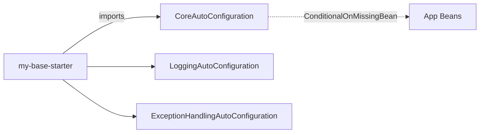

## 1. Mục tiêu (Objective)

- Cung cấp Spring Boot starter để ứng dụng chỉ cần thêm một dependency là có cấu hình mặc định cho core (và các auto-config liên quan) một cách an toàn, không xung đột.

## 2. Kiến trúc/Thiết kế tổng quan (Overview)

- Kiểu: `jar` (starter). Phụ thuộc: `my-base-core`, `spring-boot-autoconfigure`.
- Chứa: các lớp `@Configuration` có điều kiện, `AutoConfiguration.imports`, metadata cho properties.

Mermaid (kích hoạt có điều kiện):



## 3. Các bước setup chi tiết (Step-by-step Setup)

1) POM và dependencies

```xml
<dependencies>
  <dependency>
    <groupId>com.mycompany.base</groupId>
    <artifactId>my-base-core</artifactId>
  </dependency>
  <dependency>
    <groupId>org.springframework.boot</groupId>
    <artifactId>spring-boot-autoconfigure</artifactId>
  </dependency>
</dependencies>
```

2) Auto-configuration classes

```java
@Configuration
@ConditionalOnClass(name = "org.springframework.boot.SpringApplication")
@EnableConfigurationProperties(CoreProperties.class)
public class CoreAutoConfiguration {
  @Bean
  @ConditionalOnMissingBean
  public ProblemDetailMapper problemDetailMapper() { return new ProblemDetailMapper(); }
}
```

3) Đăng ký imports

```
src/main/resources/META-INF/spring/org.springframework.boot.autoconfigure.AutoConfiguration.imports
```

Nội dung:

```
com.mycompany.base.autoconfig.CoreAutoConfiguration
com.mycompany.base.autoconfig.ExceptionHandlingAutoConfiguration
com.mycompany.base.autoconfig.LoggingAutoConfiguration
```

4) Metadata (tuỳ chọn)

`src/main/resources/META-INF/additional-spring-configuration-metadata.json` để mô tả properties.

## 4. Cấu hình (Configuration)

- Luôn dùng `@ConditionalOnMissingBean` để không override bean của ứng dụng.
- Bật/tắt theo property: `base.core.enabled=true`.

## 5. Cách kiểm thử/triển khai (Testing & Deployment)

- Kiểm thử: khởi chạy sample app, kiểm tra auto-config tạo beans mặc định; confirm có thể override.
- Triển khai: publish artifact `my-base-starter`; ứng dụng chỉ cần thêm dependency.

## 6. Lưu ý mở rộng/Best practices

- Không kéo theo modules optional (security, cache, observability) nếu không có điều kiện rõ ràng.
- Giữ cấu hình tối thiểu; các thành phần nhạy cảm luôn có nút bật/tắt qua properties.

## 7. Tài liệu tham khảo (References)

- Spring Boot AutoConfiguration, Conditional Annotations, Configuration Metadata.

